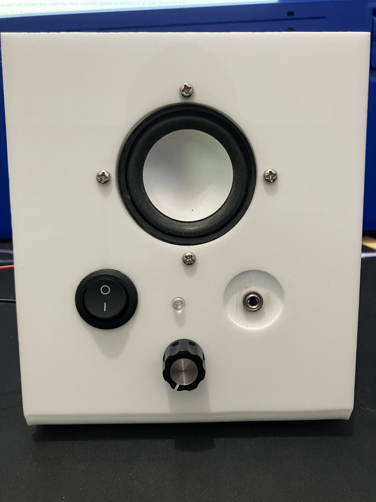
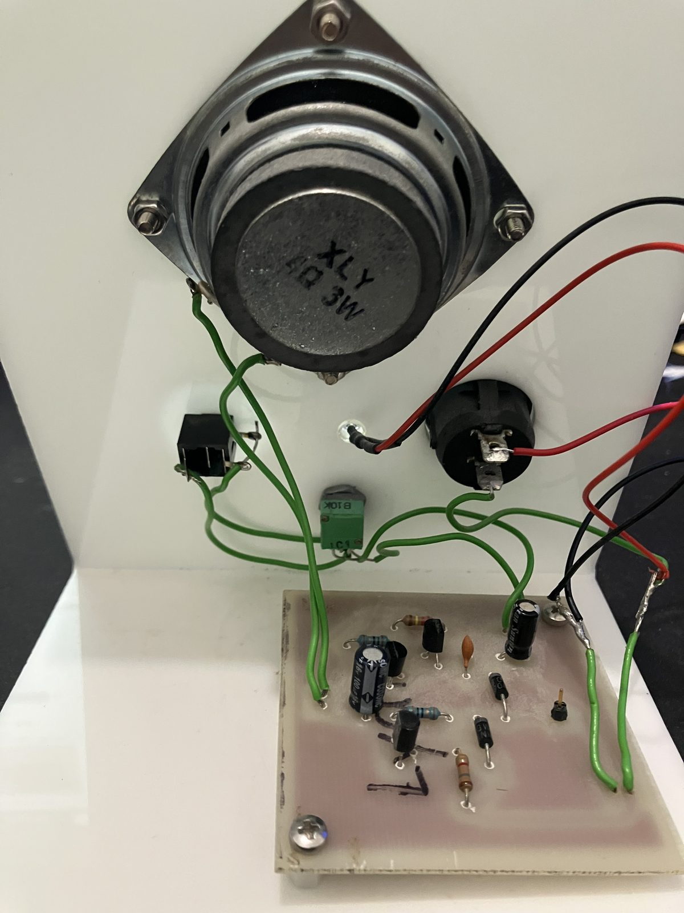
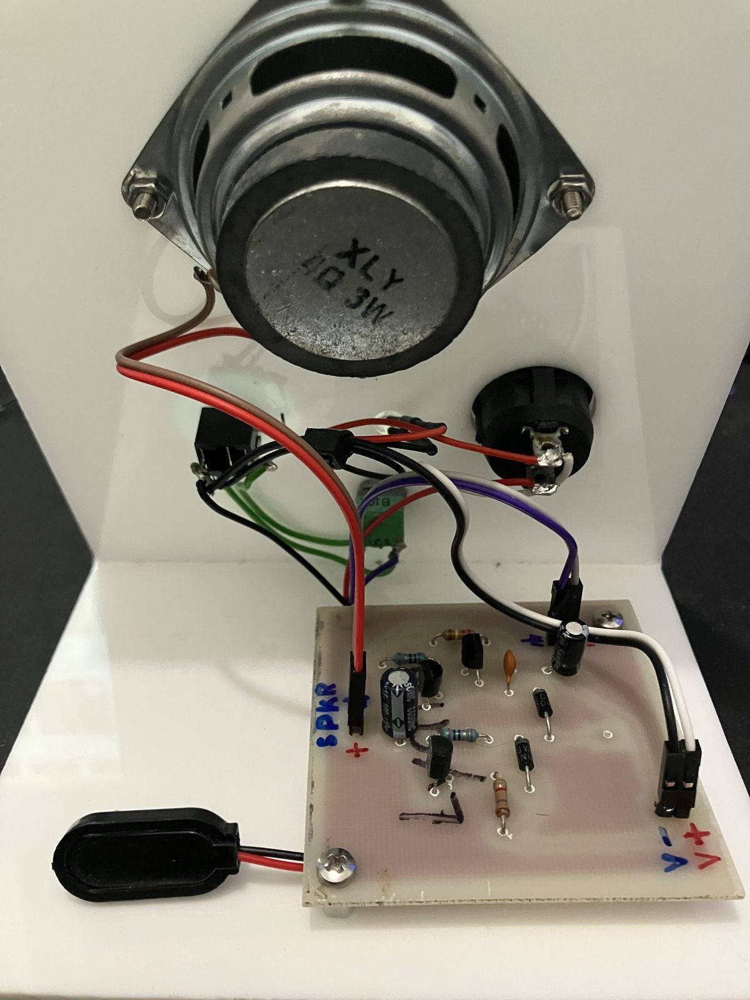
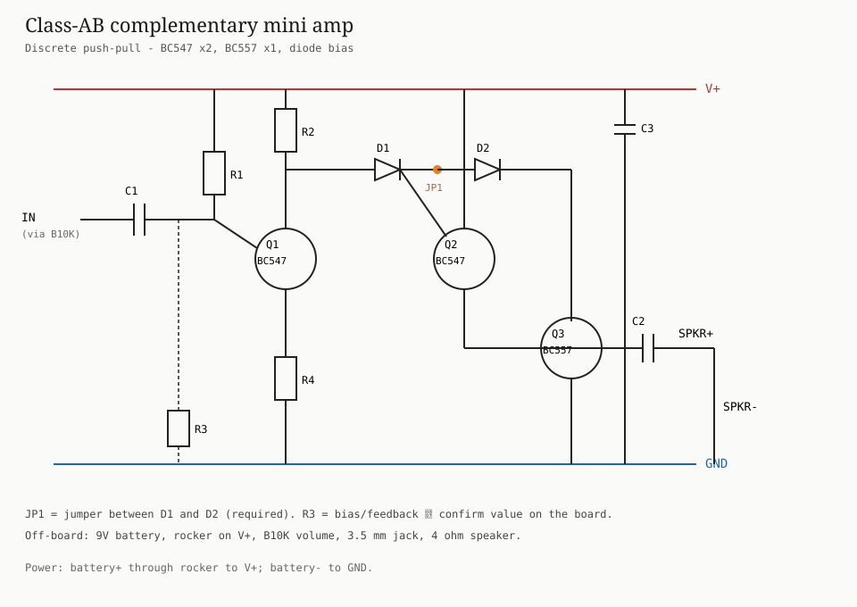
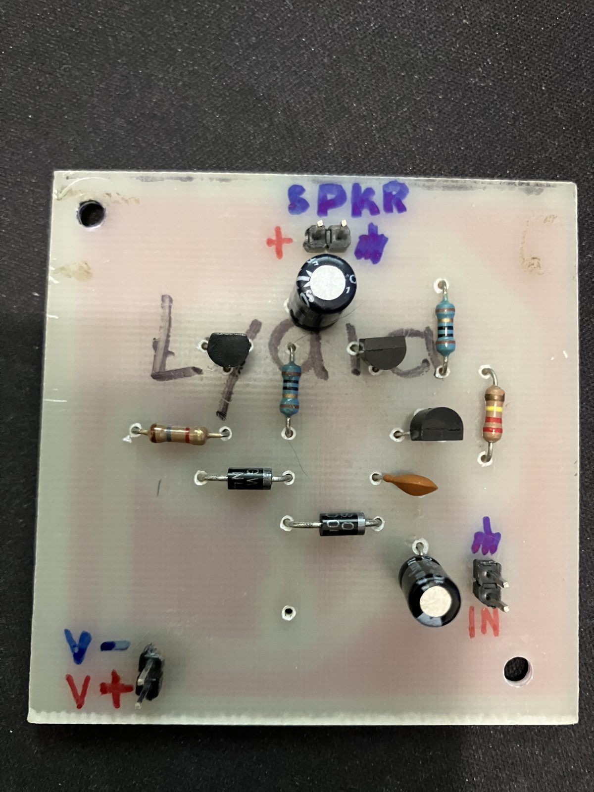
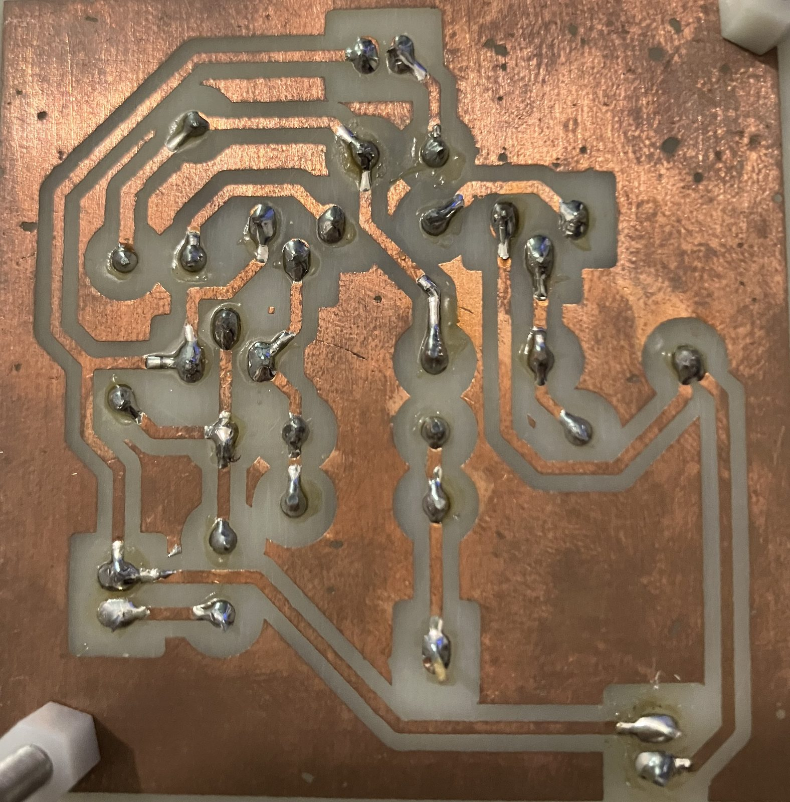

# Class-AB mini amp

<p class="lede">A small discrete amplifier on an acrylic stand — phone in, speaker out.</p>

<figure class="hero">
  
  <figcaption>Front — 4 Ω speaker, power, volume, aux in</figcaption>
</figure>

## Story

Thank you to the young lady who gifted me this little amp. A quiet handmade thing on a white acrylic stand: speaker on the face, volume and a jack underneath, battery on the back. A kind present, and it deserved to be looked after.

<figure>
  
  <figcaption>As received — green hookup wire everywhere</figcaption>
</figure>

I tidied the wiring: the old green leads are gone from the board headers. Power, speaker, and signal now use pin connectors so the panel and the PCB can unplug cleanly — no more re-soldering just to lift the board.

<figure>
  
  <figcaption>After tidy-up — pin headers, 9 V clip</figcaption>
</figure>

Under the hood it is a small discrete Class-AB amp — phone in, speaker out — not an IC brick. Exact resistor values were never fully catalogued, so this page stays light on part numbers and focuses on how it hangs together and how to hook it up.

## Schematic

<figure class="schematic">
  
  <figcaption>IN → C1 → Q1 driver → D1–JP1–D2 → Q2/Q3 push-pull → C2 → SPKR</figcaption>
</figure>

## The board

<div class="gallery">
  <figure>
    
    <figcaption>Component side — SPKR / IN / V+ · V−</figcaption>
  </figure>
  <figure>
    
    <figcaption>Solder side — hand-etched copper</figcaption>
  </figure>
</div>

## Connections

Headers on the board: **SPKR**, **IN**, **V+ / V−** — all on removable pins.

**Power** — switch only the positive lead:

```text
9V +  ──► rocker switch ──► board V+
9V −  ────────────────────► board GND
```

**Input / volume**

```text
3.5 mm tip     ──► B10K pot (hot)
B10K wiper     ──► board IN
B10K other end ──► GND
jack sleeve    ──► GND
```

**Speaker** (typical load: 4 Ω / 3 W)

```text
board SPKR+ ──► speaker
board SPKR− ──► speaker (GND)
```

## Quick test

1. Electrolytic stripes (−) toward GND; JP1 fitted.
2. Power on briefly — nothing should get hot.
3. Pot up, finger on IN / jack tip → hum.
4. Phone → jack → music at low volume.
